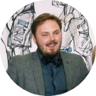

## Over mij

Hoi!

Mijn naam is Robin en ik ben een computationele (wiskundige) bioloog aan het [Hubrecht](https://www.hubrecht.eu/research-groups/kind-group/){:target="_blank"} Instituut voor Ontwikelingsbiologie en Stamcelonderzoek.

## Mijn onderzoek
Het wiskundige gedeelte kenmerkt zich doordat ik gebruik maak van veel statistiek en 
ander analytisch gereedschap om biologische vraagstuken te kunnen beantwoorden.
Op dit moment is mijn onderzoek gericht op hoe DNA opgeslagen zit in de cel. 
DNA bevat genen, welke veel bepalen van hoe het organisme eruit ziet en werkt. 
De kleur van je ogen is bijvoorbeeld bepaald door je genen. 
Helaas kunnen de verkeerde genen op het verkeerde moment afgelezen worden, wat kan leiden tot ziektes zoals kanker.
De manier van opslag heeft een groot effect op welke genen gebruikt worden. 
Ik bestudeer dit proces in twee hoofdlijnen: DNA-opslag tijdens de ontwikkeling, van eicel naar embryo, en DNA-opslag in de verschillende cellen van het netvlies.
Mijn uiteindelijke hoop hierbij is dat ik kan bijdragen aan de kennis op het gebied van gen-regulatie tijdens ontwikkeling en zicht [^1]. 

## Publicaties

- Systemic Loss and Gain of Chromatin Architecture throughout Zebrafish Development.
- The Cohesin Release Factor WAPL Restricts Chromatin Loop Extension.

## Opleiding
- PhD in 3D genomica aan het Nederlands Kanker Instituut / Antonie van Leeuwenhoek ziekenhuis
- MSc. in Cancer, Stem cells and Development aan de Universiteit Utrecht (honours-track)
- BSc. in Biologie aan de Universiteit Utrecht

----

[^1]: Hoewel dit erg vaag is, is dat ook het mooie aan nieuwsgierigheid-gedreven onderzoek: we weten gewoon niet wat die kennis ons gaat brengen op de langere termijn.
